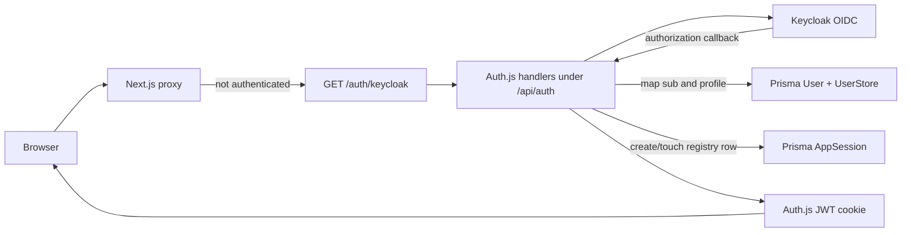

# Authentication, User Management, and Super Admin

This document describes the Auth.js/Keycloak authentication, application user management, and super-admin panel in this repository as of commit `ffa65a1` (`fix auth sign out`). It is a description of the code as implemented, including the store magic-link provider that shares the Auth.js session pipeline with Keycloak.

## System model

The application separates authentication and authorization into four layers:

1. **Keycloak authenticates people.** Auth.js uses Keycloak as an OpenID Connect provider and receives the Keycloak subject and profile.
2. **Auth.js owns the application login cookie.** There is no Auth.js database adapter, so the application uses Auth.js's JWT session strategy and an encrypted session cookie protected by `AUTH_SECRET`. Keycloak access, ID, and refresh tokens are not copied into the application JWT.
3. **Prisma owns application authorization.** The Keycloak `sub` is mapped to `User.keycloakSub`; the Prisma user supplies the application user ID, user type, sale channel, and store access.
4. **`AppSession` adds server-side revocation.** Each Keycloak login gets an application session UUID. The row is touched while the JWT is evaluated and can be revoked independently of the Auth.js cookie.

The installed versions are Next.js `16.2.2` and `next-auth` `^5.0.0-beta.30`; see [`package.json`](../package.json#L19).



## Configuration

The shared, proxy-safe configuration is in [`auth.config.ts`](../auth.config.ts#L1):

- The provider is `next-auth/providers/keycloak` with provider ID `keycloak`.
- `clientId`, `clientSecret`, and `issuer` come from `AUTH_KEYCLOAK_ID`, `AUTH_KEYCLOAK_SECRET`, and `AUTH_KEYCLOAK_ISSUER`.
- `trustHost: true` tells Auth.js to trust the request host when constructing URLs. The deployment proxy must therefore supply a trustworthy host.
- Auth.js errors are sent to `/auth/error`.
- No adapter or explicit `session.strategy` is configured. With this provider set, Auth.js uses its JWT-cookie session behavior rather than persisted Auth.js `Account` and `Session` rows.
- No session `maxAge` or cookie override is configured. In the installed Auth.js version, the default JWT-session maximum age is 30 days; the Auth.js session action reissues the JWT/cookie with a renewed expiry when its response cookies reach the browser.

The required environment variables are documented in [`.env.example`](../.env.example#L7):

| Variable | Purpose |
| --- | --- |
| `AUTH_SECRET` | Auth.js secret used to protect session and flow cookies. |
| `AUTH_URL` | Canonical application origin, for example `http://localhost:4000`. |
| `AUTH_KEYCLOAK_ID` | Confidential OIDC client ID. |
| `AUTH_KEYCLOAK_SECRET` | Confidential OIDC client secret. |
| `AUTH_KEYCLOAK_ISSUER` | Realm issuer, including `/realms/{realm}`. |
| `AUTH_KEYCLOAK_ADMIN_CLIENT_ID` | Service-account client used by the Keycloak Admin API integration. |
| `AUTH_KEYCLOAK_ADMIN_CLIENT_SECRET` | Secret for that service-account client. |

The normal Keycloak client must allow Auth.js's callback URL:

```text
${AUTH_URL}/api/auth/callback/keycloak
```

`AUTH_URL` must match the origin through which the browser reaches the app. The Admin API client is separate from the login client and needs realm permissions sufficient to view/manage users and sessions for the operations described below.

## Auth.js composition and endpoints

[`lib/auth.ts`](../lib/auth.ts#L236) creates the full Auth.js instance and exports `handlers`, `auth`, `signIn`, and `signOut`. It starts with the shared configuration, keeps its `authorized` callback, adds the store magic-link credentials provider, and replaces the shared `session` callback with the full Prisma-aware callback.

[`app/api/auth/[...nextauth]/route.ts`](../app/api/auth/%5B...nextauth%5D/route.ts#L1) exposes the Auth.js `GET` and `POST` handlers at `/api/auth/*`. That includes the provider sign-in, OAuth callback, session, CSRF, and Auth.js sign-out machinery.

There are two Auth.js providers in the full server configuration:

| Provider | Type | Purpose |
| --- | --- | --- |
| `keycloak` | OIDC/OAuth | Normal internal and distributor Keycloak login. |
| `store-magic-link` | Credentials | Store sale-channel links; documented briefly in [Store magic-link authentication](#store-magic-link-authentication). |

The Next.js proxy intentionally creates a lighter Auth.js instance directly from `auth.config.ts`. This avoids importing Prisma and Node-only authentication code into the proxy path; see [`proxy.ts`](../proxy.ts#L1).

## Keycloak sign-in flow

### 1. A protected page redirects to the Keycloak entry route

The proxy protects non-API page routes. When `req.auth.user` is absent, it redirects to:

```text
/auth/keycloak?callbackUrl=<original absolute URL>
```

The public page paths are:

- `/auth/error`
- `/auth/keycloak`
- `/auth/signed-out`
- `/auth/signout`
- everything below `/magic/store/`

Static assets and every `/api/*` route are excluded by the matcher; see [`proxy.ts`](../proxy.ts#L36). API authentication is consequently the responsibility of each route handler, not the proxy.

### 2. The entry route validates the return URL and starts Auth.js

[`app/auth/keycloak/route.ts`](../app/auth/keycloak/route.ts#L8) accepts a `callbackUrl`, resolves it against the request, and permits it only when it has the same origin. Invalid or cross-origin values fall back to `/`. It then calls:

```ts
await signIn("keycloak", { redirectTo });
```

This route exists to go directly to Keycloak without displaying an Auth.js provider picker. Auth.js errors are redirected to `/auth/error?error=<AuthError.type>`.

### 3. Auth.js completes OIDC and runs `signIn`

After Keycloak redirects to `/api/auth/callback/keycloak`, Auth.js validates the OIDC flow and invokes the custom [`signIn` callback](../lib/auth.ts#L266).

For non-Keycloak providers, a missing profile, or a profile without a string `sub`, the callback allows sign-in without doing Keycloak user synchronization. For a Keycloak profile it:

1. Uses `profile.sub` as the Keycloak identity.
2. Uses `profile.email`, or `<sub>@keycloak.local` if email is absent.
3. Uses `profile.name`, then `profile.preferred_username`, then `null` for the name.
4. Looks up `User.keycloakSub`.
5. If no row exists, calls `syncUserWithDefaultStore` to provision one.

Provisioning in [`lib/store.ts`](../lib/store.ts#L153) is transactional. It creates the default store if needed, upserts an `internal` user, grants the user access through `UserStore`, and ensures the default store sale channel exists. An existing user found by `keycloakSub` is returned as-is during a normal login; current Keycloak profile values are not routinely written back to an existing row.

The database identity requirements are visible in [`prisma/schema.prisma`](../prisma/schema.prisma#L513):

- `User.id` is the application UUID used by relations such as `createdById`.
- `User.keycloakSub` is a unique PostgreSQL UUID. The Keycloak subject must therefore be UUID-compatible.
- `User.email` is a unique application email. `realEmail` and `realName` preserve display/contact identity separately from generated application aliases.
- `User.type` and `saleChannelId` are database authorization data; Keycloak roles or groups are not mapped.

If Prisma is unavailable, the `signIn` callback deliberately returns `true` so the OIDC callback can complete. The JWT callback then attempts the same resolution and marks the token for forced sign-out if it still cannot resolve the application user.

### 4. The `jwt` callback builds and validates the application identity

The [`jwt` callback](../lib/auth.ts#L310) runs at initial login and whenever Auth.js evaluates the JWT session.

On initial Keycloak login it sets:

- `authProvider = "keycloak"`;
- a new random `appSessionId`;
- `keycloakSessionId`, if one can be found;
- `realEmail` and `realName` from the Keycloak profile.

The Keycloak session ID is searched in this exact order in [`keycloakSessionIdFromAuthPayload`](../lib/auth.ts#L55):

1. `profile.sid`
2. `profile.session_state`
3. `account.session_state`
4. `sid` or `session_state` decoded from `account.id_token`
5. `sid` or `session_state` decoded from `account.access_token`

The last two reads only Base64URL-decode the JWT payload to extract a claim; this helper does not itself verify the token. The provider tokens are not copied into the Auth.js JWT after the session ID is extracted.

The callback then resolves the Prisma user in this order:

1. `token.appUserId`, if it still identifies a row;
2. `User.keycloakSub = token.sub`;
3. provision a missing user with the profile/token identity.

It copies the following authorization fields into the Auth.js JWT:

| JWT field | Source |
| --- | --- |
| `appUserId` | `User.id` |
| `userType` | `User.type` |
| `saleChannelId` | `User.saleChannelId` |
| `saleChannelType` | related `SaleChannel.type` |
| `authProvider` | `keycloak` or `store-magic-link` |
| `appSessionId` | random UUID for this Keycloak login |
| `keycloakSessionId` | Keycloak `sid`/`session_state`, when available |
| `realEmail`, `realName` | initial Keycloak profile or Prisma fallback |
| `forceSignOut` | set when the app user/session can no longer be trusted |

No Keycloak role, realm role, client role, or group claim is used for application authorization.

### 5. The Keycloak login is registered as an application session

After resolving the user, the JWT callback calls `touchKeycloakAppSession`; see [`lib/auth.ts`](../lib/auth.ts#L98) and [`lib/app-sessions.ts`](../lib/app-sessions.ts#L34). The `AppSession` row stores:

- application session UUID;
- Prisma user UUID;
- Keycloak subject and session ID;
- first forwarded IP (`x-forwarded-for`, then `x-real-ip`);
- user agent;
- creation, last-seen, and revocation timestamps.

IP addresses are truncated to 128 characters and user agents to 512. A row is active only if it belongs to the same user, has no `revokedAt`, and has been seen in the last 30 days. Each successful touch updates `lastSeenAt`; the 30-day registry lifetime is therefore rolling.

If a row is revoked, expired, or unexpectedly belongs to another user, the JWT receives `forceSignOut`. If only the registry operation is unavailable after the user lookup succeeded, the app logs a warning and continues without server-side revocation enforcement for that request.

### 6. The `session` callback exposes a database-backed session

The [`session` callback](../lib/auth.ts#L394) first exposes `authProvider`, `keycloakSessionId`, and `appSessionId`. It then validates the Prisma user again, preferring `appUserId` and falling back to `token.sub`, and exposes:

```ts
session.user.id              // Prisma User.id, not Keycloak sub
session.user.type            // "internal" | "distributor"
session.user.saleChannelId
session.user.saleChannelType
session.authProvider
session.keycloakSessionId
session.appSessionId
```

The type augmentation is in [`types/next-auth.d.ts`](../types/next-auth.d.ts#L3).

If `forceSignOut` is set, the callback sets `session.forceSignOut = true` and removes `session.user`. A missing/unavailable app user during session materialization also marks the token for forced sign-out. The one fallback case with neither `appUserId` nor `sub` leaves the session present but assigns an `internal` type with no sale channel and logs a warning.

## Continuing session behavior

The continuing browser session is the Auth.js JWT cookie. There is no code that persists a Keycloak access token or refresh token, refreshes provider tokens, or calls Keycloak on every request to confirm the Keycloak session is still active. `keycloakUserSessionExists` is defined in [`lib/keycloak-admin.ts`](../lib/keycloak-admin.ts#L449) but is not called elsewhere.

Consequences of the implemented model:

- The Auth.js JWT session uses the installed default 30-day idle lifetime because the app does not override `maxAge`.
- Ending a Keycloak session outside this app does not by itself invalidate an already issued Auth.js cookie.
- Revoking an `AppSession` row takes effect on the next full JWT evaluation/touch and produces `forceSignOut`.
- Removing the Prisma user or losing database access also causes forced sign-out when the full authentication callbacks run.
- The `AppSession` registry is only created/touched for `authProvider === "keycloak"`, not store magic-link sessions.

## Route protection and authorization

### Pages

[`auth.config.ts`](../auth.config.ts#L27) supplies the Auth.js `authorized` callback used by the proxy:

- public auth/magic-link paths are allowed;
- `forceSignOut` redirects to `/auth/signout`;
- every other matched page requires `auth.user`.

[`proxy.ts`](../proxy.ts#L19) additionally sends unauthenticated page requests through the direct Keycloak entry route. `/super-admin/*` has an email allow-list check. The allow-list currently contains one hard-coded email in [`lib/super-admin-constants.ts`](../lib/super-admin-constants.ts#L1). Server-side super-admin code rechecks the Prisma user's `realEmail` through [`requireSuperAdmin`](../lib/super-admin.ts#L9).

[`components/app-chrome-client.tsx`](../components/app-chrome-client.tsx#L66) provides a client-side fallback redirect when the server-rendered shell is unauthenticated. Its distributor page allow-list is a navigation/UI guard; sensitive server operations must still enforce authorization in their route handlers.

### API routes

The proxy matcher excludes all `/api/*` paths. Business API handlers use server helpers instead:

| Helper | Behavior |
| --- | --- |
| `getSessionUserId()` | Calls `auth()` and returns the Prisma user ID unless the session is forced out. |
| `requireAppUserId()` | Requires a session and verifies that `User.id` still exists. |
| `requireStoreContext()` | Requires a user with an assigned store. Distributors are rejected unless `allowDistributor: true` is passed. |
| `requireInternalStoreContext()` | Requires a store context and rejects distributors. |
| Direct `auth()` | Used by endpoints with specialized checks, such as storage and account-session APIs. |

See [`lib/session-user.ts`](../lib/session-user.ts#L7) and [`lib/store-context.ts`](../lib/store-context.ts#L77). `requireStoreContext` returns `401` when no authenticated user exists, `403` when an authenticated user has no assigned store, and by default `403` for distributor-only restrictions. Route queries then use `context.storeId`, `context.userId`, `context.userType`, and sale-channel fields to scope data.

When adding an API route, page protection is not inherited: the handler must use one of these helpers or implement an intentionally public/webhook-specific verification mechanism.

## Super-admin authorization and panel

Super-admin access is an application email allow-list, not a Keycloak role, Keycloak group, Prisma role, or `User.type`. The only configured identity is the hard-coded `SUPER_ADMIN_EMAIL` in [`lib/super-admin-constants.ts`](../lib/super-admin-constants.ts#L1). Comparison trims and lowercases both sides. `isSuperAdminEmail` currently logs the presented and configured emails.

Access to `/super-admin/*` has two checks:

1. [`proxy.ts`](../proxy.ts#L27) compares `req.auth.user.email` when that value is present. A mismatch redirects to `/`. If the email is absent, the proxy does not make a super-admin decision and the server layout remains authoritative.
2. [`app/super-admin/layout.tsx`](../app/super-admin/layout.tsx#L1) calls [`requireSuperAdmin`](../lib/super-admin.ts#L9) for the whole subtree. It requires a full Auth.js session with a Prisma user ID, reloads that `User`, and compares **`User.realEmail`** to `SUPER_ADMIN_EMAIL`. Missing sessions enter Keycloak with `/super-admin` as the callback; missing users or mismatched emails redirect to `/`.

The second check does not test `User.type`, so the hard-coded `realEmail` match is the actual server-side privilege boundary. The proxy's Auth.js email and the layout's Prisma `realEmail` are different data sources; both normally originate from the Keycloak profile for an internally provisioned user.

### Panel behavior

[`app/super-admin/page.tsx`](../app/super-admin/page.tsx#L32) reads every store and user without store scoping after the parent layout has authorized the request.

The **Stores** table displays:

- name and slug;
- theme color and font summary;
- email and website;
- number of `UserStore` memberships;
- creation time.

A store can be edited through [`updateSuperAdminStore`](../app/super-admin/actions.ts#L27), a server action that calls `requireSuperAdmin()` again before changing state. It validates the store UUID and payload, then updates name, slug, email, website, and the theme's primary/foreground colors, logo hue rotation, heading font, and body font. It handles duplicate slugs and missing stores, invalidates the store cache tag, and revalidates `/super-admin`. It does not create/delete stores, change the logo, or manage store memberships.

The **Users** table is read-only. It displays each user's application email, name, real email, `UserStore` count, and creation time. It does not display Keycloak subject, user type, sale-channel linkage, sessions, or permissions, and it has no create, edit, disable, delete, password-reset, or membership-assignment action.

[`components/super-admin-shell.tsx`](../components/super-admin-shell.tsx#L8) supplies a dedicated header with links back to the app, theme selection, account access, and sign-out. [`components/app-chrome-client.tsx`](../components/app-chrome-client.tsx#L110) selects this shell by pathname. There is no current main-navigation link to `/super-admin`; the route is reached directly.

## Application user management

There is no single general-purpose user-management service or user CRUD API. At runtime, users enter the system through three lifecycle paths, and the super-admin page only observes them:

| User origin | Authentication | Prisma type/link | Provisioning trigger | Keycloak management |
| --- | --- | --- | --- | --- |
| Internal user | Keycloak OIDC | `internal`, no sale channel | First Keycloak sign-in | Existing Keycloak identity is consumed; the app does not create it. |
| Distributor login | Keycloak OIDC | `distributor`, one `SaleChannel` | Create/edit a distributor sale channel with login enabled | App creates/updates the Keycloak user and password through the Admin API. |
| Store login | Auth.js credentials magic link | `distributor`, one `store` sale channel | Redeem a valid store magic link | No Keycloak identity; `keycloakSub` is a generated schema placeholder. |

### User and membership model

[`prisma/schema.prisma`](../prisma/schema.prisma#L513) defines the application identity:

- `User.id` is the UUID used for application relations and session authorization.
- `User.keycloakSub` is unique and UUID-typed. It is the real Keycloak subject for Keycloak accounts.
- `User.email` is unique and may be an internal application alias.
- `realEmail`/`realName` retain the actual contact/display identity.
- `User.type` is `internal` or `distributor`.
- Unique `User.saleChannelId` makes a login user belong to at most one sale channel and gives a sale channel at most one `loginUser`.
- `UserStore` is a many-to-many membership table. Store access is resolved from these rows, not inferred from Keycloak claims.

The active store cookie only selects among the current user's `UserStore` memberships; [`listUserStores`](../lib/store.ts#L113) reloads those memberships from Prisma.

### Internal users

Internal users are just-in-time provisioned by the Keycloak sign-in flow described above. A missing `User.keycloakSub` produces an `internal` user, the default store if needed, a default `UserStore` membership, and the default store sale channel. There is no application screen or API for an administrator to pre-create, edit, disable, delete, or assign additional stores to internal users.

For an existing internal user, a normal Keycloak sign-in reuses the Prisma row. It does not routinely synchronize changed Keycloak email/name data into that row. The current Keycloak profile still supplies the Auth.js session's standard name/email fields for that login.

### Distributor users managed through sale channels

Distributor account management lives in the sale-channel UI and API, not the super-admin panel. The form in [`components/po/sale-channels/sale-channel-form.tsx`](../components/po/sale-channels/sale-channel-form.tsx#L159) shows email and password fields when the channel type is `distributor`, and the table exposes a `loginEnabled` badge based on whether `SaleChannel.loginUser` exists.

Creating a distributor channel through [`POST /api/sale-channels`](../app/api/sale-channels/route.ts#L153) requires an internal store context, an email, and an 8-to-256-character password. It performs these steps:

1. Calls `provisionDistributorKeycloakUser` before opening the Prisma transaction.
2. Creates or reuses an enabled, email-verified Keycloak user and sets a non-temporary password.
3. Requires Keycloak's returned user ID to be a UUID.
4. Creates the sale channel in the active store.
5. Creates or reuses a Prisma distributor by Keycloak subject, or by email only when the existing row is already a distributor.
6. Stores the actual email/name in `realEmail`/`realName`; `User.email` uses the lowercased email when available or a unique `@po-app.local` alias on collision.
7. Links the user to the sale channel and grants a `UserStore` membership for the active store.
8. Creates and dispatches an “account ready” notification.

Editing through [`PATCH /api/sale-channels/[id]`](../app/api/sale-channels/%5Bid%5D/route.ts#L161) also requires an internal store context. Exact login behavior is:

- An existing login causes the Keycloak email/name to be updated even when the password field is blank.
- A supplied password is stored as a new non-temporary Keycloak password; a blank password preserves the existing one.
- A distributor channel without a login gets one when a password is supplied.
- A channel with a login cannot change type until that login is removed.
- The Prisma login user is reconciled by Keycloak subject, the current target user, or an existing distributor with the email, then linked to the channel and store.
- Granting/reusing the user adds the target `UserStore` row but does not remove older store memberships.

The current APIs do not implement the “remove sale channel login” operation referenced by the type-change validation message. Deleting a sale channel is refused while any login user remains linked. There is also no general distributor disable/delete endpoint; Keycloak user deletion only occurs as a reconciliation step when provisioning switches from an obsolete Keycloak ID to a different existing user found by exact email.

Keycloak provisioning occurs before the Prisma transaction on create and update. There is no compensating rollback if the subsequent database transaction fails, so Keycloak may already contain a created/updated user or password when the application operation returns a database error.

### Keycloak distributor provisioning details

[`provisionDistributorKeycloakUser`](../lib/keycloak-admin.ts#L326) uses this resolution order:

1. If an existing Keycloak user ID is supplied, update that user.
2. If Keycloak rejects username changes with `400`, retry while preserving the username and updating the remaining fields.
3. If the old ID is missing/conflicting, search for an exact email match and update it.
4. Otherwise create a user with username/email set to the normalized email, `enabled: true`, `emailVerified: true`, first name from the sale-channel name, last name `distributor`, and an optional permanent password.

If the email lookup resolves to a different user while replacing an old ID, the old Keycloak user is deleted after the replacement is updated. Every call obtains a fresh Admin API service-account token.

### Distributor self-service password changes

The account page shows the change-password form only for a Prisma distributor whose related sale-channel type is also `distributor`; see [`app/account/page.tsx`](../app/account/page.tsx#L57). [`POST /api/distributor/change-password`](../app/api/distributor/change-password/route.ts#L17) repeats those checks against the store context and a fresh Prisma lookup, then resets the password for `User.keycloakSub` through the Admin API.

The request requires matching new/confirmation values and a password length of 8–256 characters. It does not ask for or verify the old password because the authenticated application session authorizes an administrative Keycloak password reset. The application makes no explicit call to revoke Auth.js, application, or Keycloak sessions after the reset; any additional Keycloak-side behavior depends on the realm configuration.

Internal users have no equivalent password endpoint in this application; their password lifecycle remains in Keycloak.

### Store magic-link users

Store login users are created or updated when a valid magic link is redeemed. [`ensureStoreSaleChannelLoginUser`](../lib/sale-channel-magic-links.ts#L48) finds the existing user by unique `saleChannelId`, assigns an application-only `@po-app.local` email, copies the sale-channel email/name to the real identity fields, sets `type = "distributor"`, grants the channel's store through `UserStore`, and generates a random `keycloakSub` only when it must create the row.

These users are not created in Keycloak and cannot use the distributor password-change API. Their authentication remains valid while the Auth.js magic-link session cookie is valid; revoking the source link prevents later redemptions but does not revoke an already issued Auth.js session.

### User changes and existing sessions

Prisma authorization fields are refreshed during full Auth.js JWT/session evaluation. Changing `User.type`, `saleChannelId`, or related sale-channel type therefore affects a continuing session when it is next materialized. Removing the Prisma user forces sign-out when the callbacks can no longer resolve it, and revoking an `AppSession` forces a Keycloak-authenticated app session out on its next registry touch.

By contrast, changing or deleting a user only in Keycloak is not continuously checked against existing Auth.js cookies. The application does not explicitly revoke sessions after password resets, and there is no automatic session revocation attached to the sale-channel user-management operations.

## Client session use

[`components/providers.tsx`](../components/providers.tsx#L63) wraps the application in `SessionProvider` with `basePath="/api/auth"`. Client components use `useSession()` where they need reactive identity. [`components/auth-controls.tsx`](../components/auth-controls.tsx#L20) starts Keycloak with `signIn("keycloak")` and submits logout to `/auth/signout`.

Server components and route handlers import `auth` from `@/lib/auth`. They must treat `session.user.id` as the Prisma `User.id`; it is deliberately not the Keycloak subject.

## Logout and revocation

[`app/auth/signout/route.ts`](../app/auth/signout/route.ts#L22) accepts both `GET` and `POST` and performs three operations:

1. If `appSessionId` is present, set that `AppSession.revokedAt`.
2. If this is a Keycloak session and `keycloakSessionId` is present, delete that Keycloak session with the Admin API.
3. Call Auth.js `signOut({ redirectTo: "/auth/signed-out" })` to clear the Auth.js login and redirect to the signed-out page.

The first two operations are best-effort: configuration/Admin API/database failures are logged, then local Auth.js logout continues. This implementation does not use Keycloak's OIDC RP-initiated logout or an `end_session_endpoint`; it deletes the known Keycloak session through the Admin REST API. If the Keycloak session ID could not be extracted at login, logout is local plus `AppSession` revocation only.

## Account session management

Keycloak users can view/revoke sessions through `/api/account/sessions`; see [`app/api/account/sessions/route.ts`](../app/api/account/sessions/route.ts#L84). The endpoint requires:

- a non-forced-out Auth.js session;
- a Prisma user;
- `session.authProvider === "keycloak"`.

It merges active `AppSession` rows with sessions returned by Keycloak and marks the current app and Keycloak IDs. It supports:

- `{"action":"revoke","sessionId":"..."}` for a non-current application or Keycloak session;
- `{"action":"logout-others"}` to revoke all other tracked app sessions and delete the corresponding/other Keycloak sessions.

The current session cannot be revoked through the single-session action; the normal sign-out route handles it. A revoked remote app cookie is rejected when it next touches its registry row.

## Keycloak Admin API integration

[`lib/keycloak-admin.ts`](../lib/keycloak-admin.ts#L73) derives the realm and REST endpoints from `AUTH_KEYCLOAK_ISSUER`. Each Admin API operation obtains a new service-account token using `client_credentials`; tokens are not cached. It then calls the realm Admin API with a bearer token.

Auth/session-related operations include:

- list a user's Keycloak sessions;
- delete a realm session;
- create/update distributor Keycloak users;
- set non-temporary distributor passwords;
- delete a superseded distributor user.

Distributor sale-channel creation/update calls this integration and stores the returned Keycloak user UUID as `User.keycloakSub`. Application authorization still comes from the associated Prisma `User`, not from Keycloak roles.

## Store magic-link authentication

The second Auth.js provider is a Credentials provider with ID `store-magic-link`; see [`lib/auth.ts`](../lib/auth.ts#L238). A request to `/magic/store/[token]` calls `signIn("store-magic-link", { token, redirectTo: "/new-order" })`.

[`lib/sale-channel-magic-links.ts`](../lib/sale-channel-magic-links.ts#L102) hashes the supplied token with SHA-256, requires an unrevoked/unexpired link for a `store` sale channel, increments its use metadata, creates or updates the distributor application user, and returns Prisma authorization fields. The JWT gets `authProvider = "store-magic-link"` and the same application authorization claims, but it gets no Keycloak session ID and no `AppSession` registry row.

Store magic-link login users have a generated `keycloakSub` only to satisfy the current `User` schema; that value does not represent a Keycloak account.

## Failure and recovery behavior

| Condition | Implemented result |
| --- | --- |
| User cancels or OIDC callback fails | Auth.js redirects to `/auth/error` with its error code. |
| Cross-origin `callbackUrl` | Replaced with `/`. |
| Prisma unavailable in Keycloak `signIn` | OIDC is allowed to finish; JWT resolution normally marks the login for forced sign-out. |
| Prisma user missing but database available | User is reprovisioned from `sub` and profile/token data. |
| JWT's `appUserId` is stale | It is removed, then resolved by `keycloakSub`. |
| `AppSession` is revoked/expired/mismatched | JWT is marked `forceSignOut`; proxy redirects through `/auth/signout`. |
| `AppSession` registry write alone is unavailable | Warning is logged; request continues without registry enforcement. |
| Keycloak Admin API fails during logout | Warning is logged; Auth.js cookie logout still completes. |
| Keycloak session ID is absent | Session listing has reduced correlation and logout cannot delete that Keycloak session directly. |

## Implementation invariants and maintenance notes

- Keep `auth.config.ts` free of Prisma and Node-only application code because `proxy.ts` imports it directly.
- Put full callbacks and server-only providers in `lib/auth.ts`; API handlers and server components should import from there.
- Do not assume page proxy authentication protects an API route.
- Do not use `token.sub` or `User.keycloakSub` where a Prisma relation expects `User.id`.
- Authorization changes belong in Prisma user/store/sale-channel data. No Keycloak role mapping exists today.
- Do not treat the super-admin user table as a user administration UI; it is read-only, and the actual privilege check is the hard-coded `realEmail` allow-list.
- Distributor Keycloak writes and Prisma writes are not one distributed transaction; handle or reconcile partial provisioning failures.
- Reusing a distributor user adds store membership without removing previous `UserStore` rows.
- Remote Keycloak logout and Auth.js-cookie invalidation are not continuously synchronized. The `AppSession` registry is the implemented application-side revocation mechanism.
- The session registry has a 30-day rolling activity cutoff independent of Auth.js's cookie lifetime.
- The super-admin identity is currently hard-coded, and `isSuperAdminEmail` logs the compared email values. Treat that as sensitive operational behavior if authentication logs are exported.
- Auth.js is pinned to a beta range. Re-test callback, cookie, proxy, and server-action behavior before upgrading it.

## Source map

| Area | Primary source |
| --- | --- |
| Proxy-safe provider and authorization config | [`auth.config.ts`](../auth.config.ts) |
| Full Auth.js callbacks/providers | [`lib/auth.ts`](../lib/auth.ts) |
| Auth.js route handlers | [`app/api/auth/[...nextauth]/route.ts`](../app/api/auth/%5B...nextauth%5D/route.ts) |
| Page proxy | [`proxy.ts`](../proxy.ts) |
| Direct Keycloak entry | [`app/auth/keycloak/route.ts`](../app/auth/keycloak/route.ts) |
| Logout | [`app/auth/signout/route.ts`](../app/auth/signout/route.ts) |
| Session/JWT types | [`types/next-auth.d.ts`](../types/next-auth.d.ts) |
| Forced sign-out marker | [`lib/auth-session.ts`](../lib/auth-session.ts) |
| Prisma user synchronization | [`lib/store.ts`](../lib/store.ts) |
| Store-aware authorization | [`lib/store-context.ts`](../lib/store-context.ts) |
| API user helper | [`lib/session-user.ts`](../lib/session-user.ts) |
| App session registry | [`lib/app-sessions.ts`](../lib/app-sessions.ts) |
| Account session API | [`app/api/account/sessions/route.ts`](../app/api/account/sessions/route.ts) |
| Keycloak Admin REST client | [`lib/keycloak-admin.ts`](../lib/keycloak-admin.ts) |
| Prisma models | [`prisma/schema.prisma`](../prisma/schema.prisma#L513) |
| Store magic links | [`lib/sale-channel-magic-links.ts`](../lib/sale-channel-magic-links.ts) |
| Super-admin allow-list and guard | [`lib/super-admin-constants.ts`](../lib/super-admin-constants.ts), [`lib/super-admin.ts`](../lib/super-admin.ts) |
| Super-admin page and layout | [`app/super-admin/page.tsx`](../app/super-admin/page.tsx), [`app/super-admin/layout.tsx`](../app/super-admin/layout.tsx) |
| Super-admin store management | [`app/super-admin/actions.ts`](../app/super-admin/actions.ts), [`app/super-admin/stores-table.tsx`](../app/super-admin/stores-table.tsx) |
| Distributor user creation/update | [`app/api/sale-channels/route.ts`](../app/api/sale-channels/route.ts), [`app/api/sale-channels/[id]/route.ts`](../app/api/sale-channels/%5Bid%5D/route.ts) |
| Distributor password management | [`app/api/distributor/change-password/route.ts`](../app/api/distributor/change-password/route.ts) |
